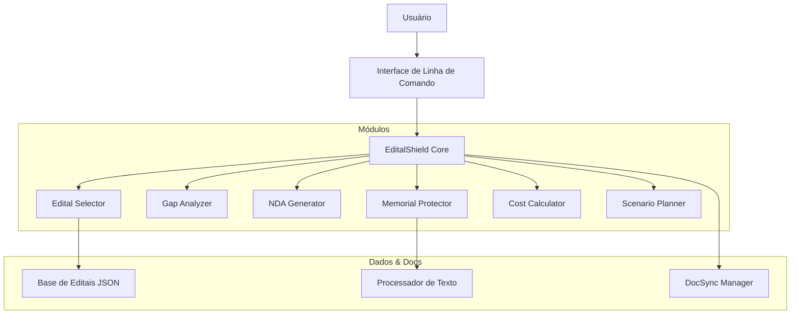

# 📘 EditalShield: Blueprint & Handout

**Versão:** 1.0.0
**Autor:** João Manoel Oliveira (Symbeon Lab)
**Repositório:** [github.com/symbeon-labs/editalshield](https://github.com/symbeon-labs/editalshield)

---

## 1. Visão Executiva

### O Problema
Startups brasileiras perdem milhões em fomento ou expõem segredos industriais ao submeter projetos a editais de inovação (Centelha, PIPE, Finep). O processo é burocrático, juridicamente arriscado e tecnicamente complexo.

### A Solução: EditalShield
Um framework open-source em Python que atua como um "escudo jurídico-técnico". Ele automatiza a análise de editais, protege a propriedade intelectual em memoriais técnicos e gera documentos jurídicos defensivos.

### Proposta de Valor
- **Proteção:** Sanitização automática de *trade secrets*.
- **Agilidade:** Análise de editais em segundos, não dias.
- **Economia:** Redução de custos com advogados via automação de contratos padrão.

---

## 2. Blueprint Técnico

### 2.1 Arquitetura do Sistema
O EditalShield segue uma arquitetura modular baseada em CLI (Command Line Interface).



### 2.2 Stack Tecnológico
- **Linguagem:** Python 3.9+
- **CLI Framework:** `click` (comandos), `rich` (interface visual)
- **Documentação:** `DocSync` (integrado), Markdown, Jinja2
- **Gerenciamento:** `pip`, `venv`, `git`

### 2.3 Estrutura de Diretórios
```
editalshield/
├── src/editalshield/       # Código fonte
│   ├── modules/            # Lógica de negócio (6 módulos)
│   ├── templates/          # Modelos de documentos/contratos
│   ├── cli.py              # Ponto de entrada da CLI
│   └── docs_manager.py     # Sistema DocSync
├── docs/                   # Documentação do projeto
│   ├── images/             # Assets visuais
│   └── ...
├── tests/                  # Testes automatizados
├── pyproject.toml          # Configuração de build
└── README.md               # Ponto de entrada para usuários
```

---

## 3. Handout: Guia de Uso Rápido

### 3.1 Instalação
```bash
# 1. Clone o repositório
git clone https://github.com/symbeon-labs/editalshield.git
cd editalshield

# 2. Crie o ambiente virtual
python -m venv venv
.\venv\Scripts\activate

# 3. Instale
pip install -e .
```

### 3.2 Comandos Principais

#### 🛡️ Gerenciar Documentação
O EditalShield possui um sistema de documentação integrado (DocSync).
```bash
# Validar se a estrutura de pastas está correta
editalshield docs validate

# Sincronizar e verificar integridade dos docs
editalshield docs sync

# Gerar índice atualizado
editalshield docs index
```

#### 🔍 Selecionar Editais (Futuro)
```bash
editalshield select --setor "Agrotech" --estagio "MVP"
```

#### 🔒 Proteger Memorial (Futuro)
```bash
editalshield protect --input "meu_projeto.md" --nivel "alto"
```

---

## 4. Roteiro de Desenvolvimento (Roadmap)

### Fase 1: Fundação (Concluída ✅)
- Estrutura de projeto criada.
- CLI base implementada.
- Sistema de documentação integrado.
- Publicação no GitHub.

### Fase 2: Lógica Core (Próxima 🚧)
- Implementação dos algoritmos de ranking de editais.
- Desenvolvimento do motor de regex para proteção de PI.

### Fase 3: Inteligência
- Adição de NLP básico para análise semântica de editais.
- Integração com LLMs (opcional) para geração de texto.

---

## 5. Recursos Adicionais
- **Repositório:** [GitHub](https://github.com/symbeon-labs/editalshield)
- **Issues:** Use para reportar bugs ou pedir features.
- **Licença:** MIT (Livre para uso e modificação).

---
*Documento gerado em 04/12/2025.*
