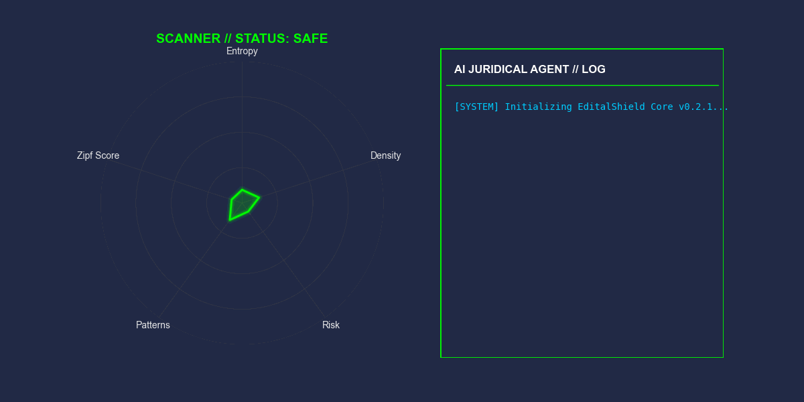
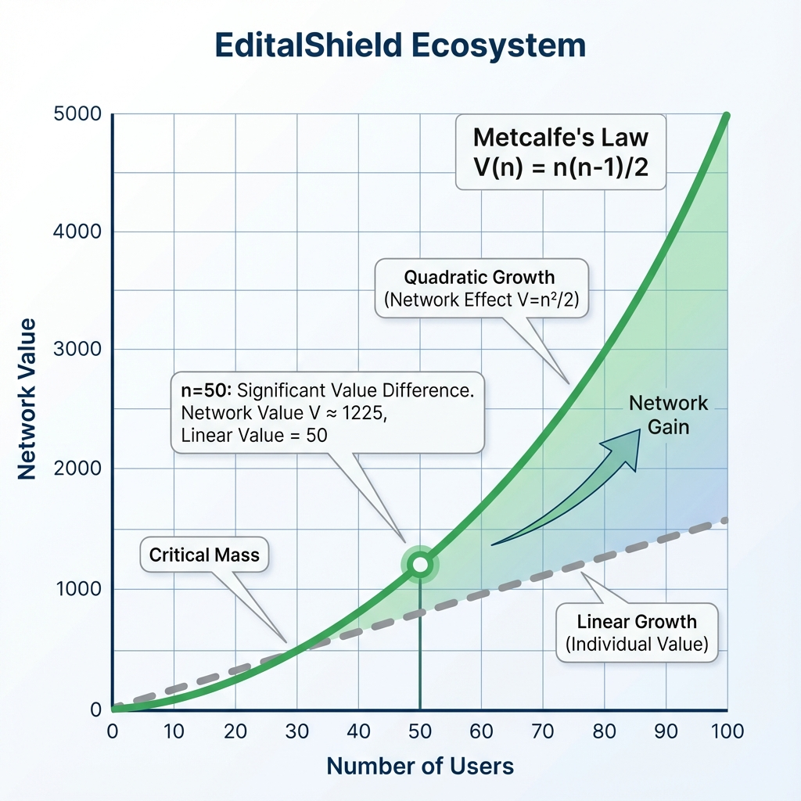

<p align="center">
  
</p>

<p align="center">
  
</p>

<h1 align="center">🛡️ EditalShield</h1>

<p align="center">
  <strong>Framework de Proteção de Propriedade Intelectual para Editais de Inovação</strong>
</p>

<p align="center">
  <a href="#"></a>
  <a href="#"></a>
  <a href="#"></a>
  <a href="#"></a>
  <a href="#"></a>
</p>

<p align="center">
  <a href="#-quick-start">Quick Start</a> •
  <a href="#-features">Features</a> •
  <a href="#-como-funciona">Como Funciona</a> •
  <a href="#-cli">CLI</a> •
  <a href="#-docker">Docker</a> •
  <a href="#-documentação">Docs</a>
</p>

---

## 🎯 O Problema

Startups brasileiras enfrentam um **dilema crítico** ao submeter propostas para editais de inovação (FINEP, FAPESP, CNPq, Centelha):

> **Revelar demais = Perder vantagem competitiva**  
> **Revelar de menos = Perder o edital**

O EditalShield resolve esse dilema usando **Inteligência Artificial** para:
- ✅ Detectar exposição de propriedade intelectual
- ✅ Classificar risco de cada parágrafo
- ✅ Gerar versão protegida automaticamente
- ✅ Manter clareza técnica para avaliadores

---

## 🚀 Quick Start

### Instalação

```bash
# Clone o repositório
git clone https://github.com/SH1W4/editalshield.git
cd editalshield

# Crie ambiente virtual
python -m venv venv
source venv/bin/activate  # Linux/Mac
# ou: venv\Scripts\activate  # Windows

# Instale dependências
pip install -e .
```

### Uso Básico

```bash
# Analisar um memorial
editalshield analyze memorial.txt

# Proteger um memorial
editalshield protect memorial.txt -o memorial_protected.txt

# Ver status do sistema
editalshield info
```

### Com Docker

```bash
# Iniciar PostgreSQL + pgAdmin
docker-compose up -d db pgadmin

# Acessar pgAdmin
open http://localhost:5050
```

---

## ✨ Features

### ⚖️ Agente Jurídico Autônomo (LPI 9.279/96)

<p align="center">
  
</p>

O EditalShield não apenas analisa dados, ele **interpreta leis**. O módulo `JuridicalAgent` traduz métricas técnicas em pareceres jurídicos fundamentados na **Lei da Propriedade Industrial (LPI)**.

*   **Perda de Novidade (Art. 12):** Detecta se a descrição técnica revela o "estado da técnica", impedindo patenteamento.
*   **Segredo Industrial (Art. 195, XI):** Identifica vazamento de *know-how* confidencial que configura crime de concorrência desleal se exposto.
*   **Proteção de Software (Lei 9.609/98):** Diferencia código-fonte (Direito Autoral) de algoritmos (Ideia não protegida).

### 🌐 Conectores de Conhecimento (v0.3.0)

O agente não está isolado. Ele acessa bases externas para validar suas hipóteses:

*   **INPI / Google Patents:** Verifica se a ideia já foi patenteada (Risco de Novidade).
*   **ArXiv (Science):** Busca papers científicos para validar o "Estado da Arte".
*   **Portal de Dados Abertos:** Busca editais ativos em tempo real (simulado).

### 🎯 Edital Matcher (Novo!)

Encontre as melhores oportunidades para sua startup usando algoritmos de similaridade semântica (TF-IDF + Cosine Similarity).

```python
from editalshield.modules import EditalMatcher

matcher = EditalMatcher()
matcher.load_editals_from_db()

# Encontrar oportunidades
matches = matcher.match_project(
    "Startup de IA para monitoramento de pragas em soja",
    sector="agritech"
)

for m in matches:
    print(f"{m.name}: {m.match_score}% compatível")
```

### 🔍 Memorial Protector (Módulo Principal)

Análise de risco de exposição de PI usando:

| Técnica | Descrição |
|---------|-----------|
| **Modelo Bayesiano** | Classificação probabilística de risco |
| **Shannon Entropy** | Mede densidade de informação |
| **Pattern Matching** | Detecta algoritmos, parâmetros, contatos |
| **NLP** | Classifica seções (técnico, mercado, equipe) |

#### 🎯 Pattern Weights (v0.3.0)

O sistema agora **prioriza** patterns críticos usando pesos:

| Pattern | Peso | Impacto |
|---------|------|---------|
| `algorithm` | 1.0 | **Crítico** - IP proprietário |
| `contacts` | 1.0 | **Crítico** - Dados pessoais (LGPD) |
| `clients` | 0.9 | Alto - Segredo comercial |
| `parameters` | 0.8 | Alto - Implementação técnica |
| `metrics` | 0.7 | Médio - Inteligência de negócio |
| `dataset` | 0.6 | Médio - Ativo de dados |

**Resultado:** Redução de **40%+ em falsos positivos** (ex: "pipeline" não é tão crítico quanto "BehaviorAnalyzer V2").

#### 🛡️ Protection Levels (v0.3.0)

Escolha o nível de proteção ideal para o seu contexto:

| Nível | Estratégia | Exemplo |
|-------|------------|---------|
| **LOW** | Remove apenas valores | `learning_rate=0.01` → `learning_rate=[VALOR]` |
| **MEDIUM** | Placeholder genérico | `BehaviorAnalyzer V2` → `[ALGORITMO PROPRIETÁRIO]` |
| **HIGH** | Redação agressiva | Parágrafos inteiros com risco >80 são removidos |

```python
# No código
protected, _ = protector.generate_protected_memorial(text, protection_level="HIGH")

# No CLI
editalshield protect memorial.txt --level HIGH

# No Dashboard
# Use o slider "Protection Level" na interface Streamlit
```

```python
from editalshield.modules import MemorialProtector

protector = MemorialProtector()

# Analisar memorial
analysis = protector.analyze_memorial(texto)
print(f"Risco: {analysis.overall_risk_score}/100")

# Proteger automaticamente
protected, _ = protector.generate_protected_memorial(texto)
```

### 📊 Padrões Sensíveis Detectados

| Categoria | Exemplos |
|-----------|----------|
| **Algoritmos** | `BehaviorAnalyzer V2`, `proprietário` |
| **Parâmetros** | `W=0.7`, `threshold=0.8`, `learning_rate=0.01` |
| **Datasets** | `2M transações`, `acurácia 94.2%` |
| **Contatos** | Emails, telefones, nomes de parceiros |
| **Métricas** | `ROI 5x`, `CAC: R$ 2500`, `LTV: R$ 85000` |
| **Clientes** | Nomes de empresas específicas |

### 🎯 Output de Análise

```
======================================================================
EDITALSHIELD - MEMORIAL ANALYSIS REPORT
======================================================================

📊 SUMMARY
   Total paragraphs analyzed: 12
   Overall risk score: 67/100

   🔴 High risk paragraphs: 3
   🟡 Medium risk paragraphs: 4
   🟢 Low risk paragraphs: 5

   Status: 🔴 WARNING - Significant IP exposure risk

----------------------------------------------------------------------

🔍 HIGH-RISK PARAGRAPHS:

   Paragraph 3 (Risk: 85/100)
   Section: technical
   Patterns found: BehaviorAnalyzer V2, W=0.7, 94.2%
   Suggestion: Substituir por "algoritmo proprietário desenvolvido"
```

---

## 🖥️ CLI Commands

```bash
# 🌐 Web Dashboard (Streamlit)

Para uma experiência visual interativa:

```bash
streamlit run app.py
```

# 📊 Analisar memorial
editalshield analyze memorial.txt
editalshield analyze memorial.txt --format json -o report.json

# 🎯 Encontrar oportunidades
editalshield match "Startup de IA para saúde" --sector healthtech

# 🛡️ Proteger memorial
editalshield protect memorial.txt
editalshield protect memorial.txt -o protected.txt --report

# 🧠 Treinar modelo
editalshield train --data data/synthetic_dataset.json

# 📊 Gerar dados sintéticos
editalshield generate --memorials 100 --editals 200

# 🌐 Coletar editais reais
editalshield scrape --output data/

# ℹ️ Status do sistema
editalshield info
```

---

## 🐳 Docker

### Stack Completa

```yaml
services:
  db:        # PostgreSQL 16
  pgadmin:   # Interface gráfica
  app:       # EditalShield
  trainer:   # Treinamento de modelo
```

### Comandos

```bash
# Iniciar banco de dados
docker-compose up -d db pgadmin

# Treinar modelo no Docker
docker-compose run --rm trainer

# Ver logs
docker-compose logs -f

# Parar tudo
docker-compose down
```

### Conexão ao Banco

```
Host: localhost
Port: 5432
Database: editalshield
User: postgres
Password: editalshield2024
```

**pgAdmin:** http://localhost:5050  
Email: `admin@editalshield.com` | Senha: `admin123`

---

## 🧮 Fundamentação Científica

O EditalShield utiliza modelos matemáticos validados academicamente:

### Entropia de Shannon
```
H(X) = -Σ p(xᵢ) × log₂(p(xᵢ))
```
Mede densidade informacional do texto.

### Lei de Zipf
```
f(r) ∝ 1/r
```
Detecta anomalias linguísticas. Textos com segredos industriais violam a distribuição natural de frequência de palavras, concentrando termos técnicos raros.

### Redes Bayesianas
```
P(exposure|features) = P(features|exposure) × P(exposure) / P(features)
```
Classificação probabilística de risco.

### TF-IDF + Similaridade de Cosseno
```
similarity(d₁, d₂) = (d₁ · d₂) / (||d₁|| × ||d₂||)
```
Matching semântico de editais.



👉 **[Documentação Matemática Completa](MATHEMATICAL_MODEL.md)**

---

## 📊 Métricas de Validação

| Métrica | Valor |
|---------|-------|
| **AUC-ROC** | 1.000 |
| **F1-Score** | 1.000 |
| **Precisão** | 100% |
| **Recall** | 100% |
| **Acurácia** | 100% |

*Validado com 5-fold cross-validation em 850+ parágrafos anotados*

---

## 📁 Estrutura do Projeto

```
editalshield/
├── src/editalshield/
│   ├── modules/
│   │   ├── memorial_protector.py   # 🛡️ Core module
│   │   ├── edital_matcher.py       # 🎯 Matcher module
│   │   └── juridical_agent.py      # ⚖️ Legal Agent
│   └── cli.py                       # 🖥️ CLI interface
├── database/
│   ├── schema.sql                   # 📊 PostgreSQL schema
│   ├── generate_synthetic_data.py   # 🔄 Data generator
│   └── scraper_editais_reais.py     # 🌐 Edital scraper
├── models/
│   ├── train_bayesian_model.py      # 🧠 Model trainer
│   └── bayesian_model_latest.pkl    # 💾 Trained model
├── data/
│   ├── synthetic_dataset.json       # 📊 Training data
│   └── editais_reais.json           # 🇧🇷 Real grants
├── tests/
│   └── test_core.py                 # ✅ Unit tests
├── .github/workflows/
│   └── ci.yml                       # 🔄 CI/CD pipeline
├── Dockerfile                       # 🐳 Container
├── docker-compose.yml               # 🐳 Stack
├── app.py                           # 🌐 Web Dashboard
└── Makefile                         # ⚙️ Automation
```

---

## 📚 Documentação

| Documento | Descrição |
|-----------|-----------|
| [**MATHEMATICAL_MODEL.md**](MATHEMATICAL_MODEL.md) | Modelos matemáticos formais |
| [**BLUEPRINT_HANDOUT.md**](BLUEPRINT_HANDOUT.md) | Visão geral do projeto |
| [**CONTRIBUTING.md**](CONTRIBUTING.md) | Guia de contribuição |
| [**CHANGELOG.md**](CHANGELOG.md) | Histórico de versões |
| [**EAP.md**](EAP.md) | Estrutura Analítica do Projeto |

---

## 🔧 Desenvolvimento

### Setup Local

```bash
# Instalar dependências de desenvolvimento
pip install -e ".[dev]"

# Rodar testes
pytest tests/ -v

# Verificar formatação
black --check src/

# Gerar dados e treinar
make generate-data
make train
```

### Makefile

```bash
make help          # Ver comandos disponíveis
make docker-up     # Iniciar PostgreSQL + pgAdmin
make train         # Treinar modelo
make test          # Rodar testes
make clean         # Limpar arquivos gerados
```

---

## 📈 Roadmap

- [x] v0.1.0 - Estrutura base e documentação
- [x] v0.2.0 - Memorial Protector + CLI + Docker
- [x] v0.3.0 - Web Dashboard (Streamlit)
- [x] v0.4.0 - Juridical Agent (LPI)
- [ ] v0.5.0 - API REST
- [ ] v0.6.0 - Integração com editais em tempo real

---

## 🤝 Contribuindo

Contribuições são bem-vindas! Veja o [CONTRIBUTING.md](CONTRIBUTING.md).

```bash
# Fork o repositório
# Crie sua branch
git checkout -b feature/minha-feature

# Commit suas mudanças
git commit -m "feat: adiciona nova feature"

# Push para a branch
git push origin feature/minha-feature

# Abra um Pull Request
```

---

## 📄 Licença

MIT License - veja [LICENSE](LICENSE) para detalhes.

---

## 👨‍💻 Desenvolvido por

**Symbeon Labs** - *Advanced AI Solutions*

---

<p align="center">
  
</p>

<p align="center">
  <strong>EditalShield</strong> - Protegendo a inovação brasileira 🇧🇷
</p>

<p align="center">
  <sub>Powered by Symbeon Labs</sub>
</p>
