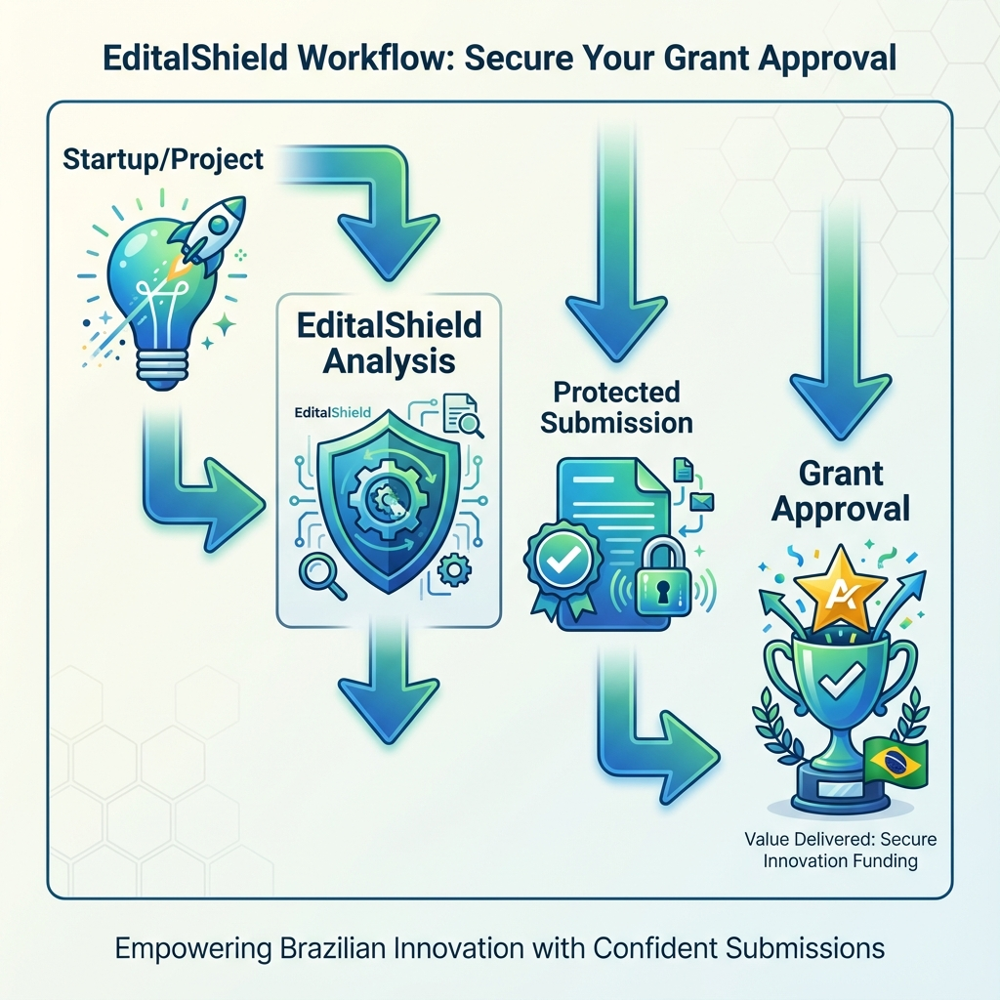
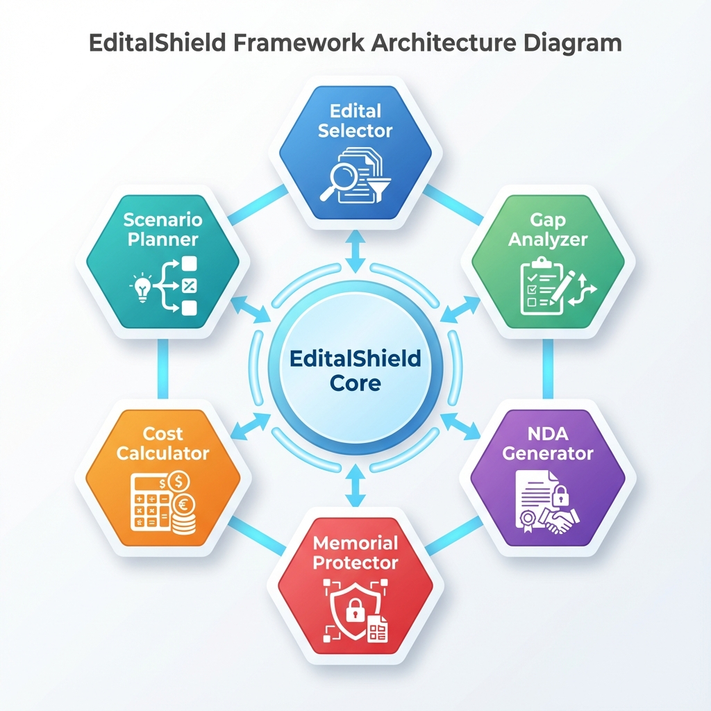
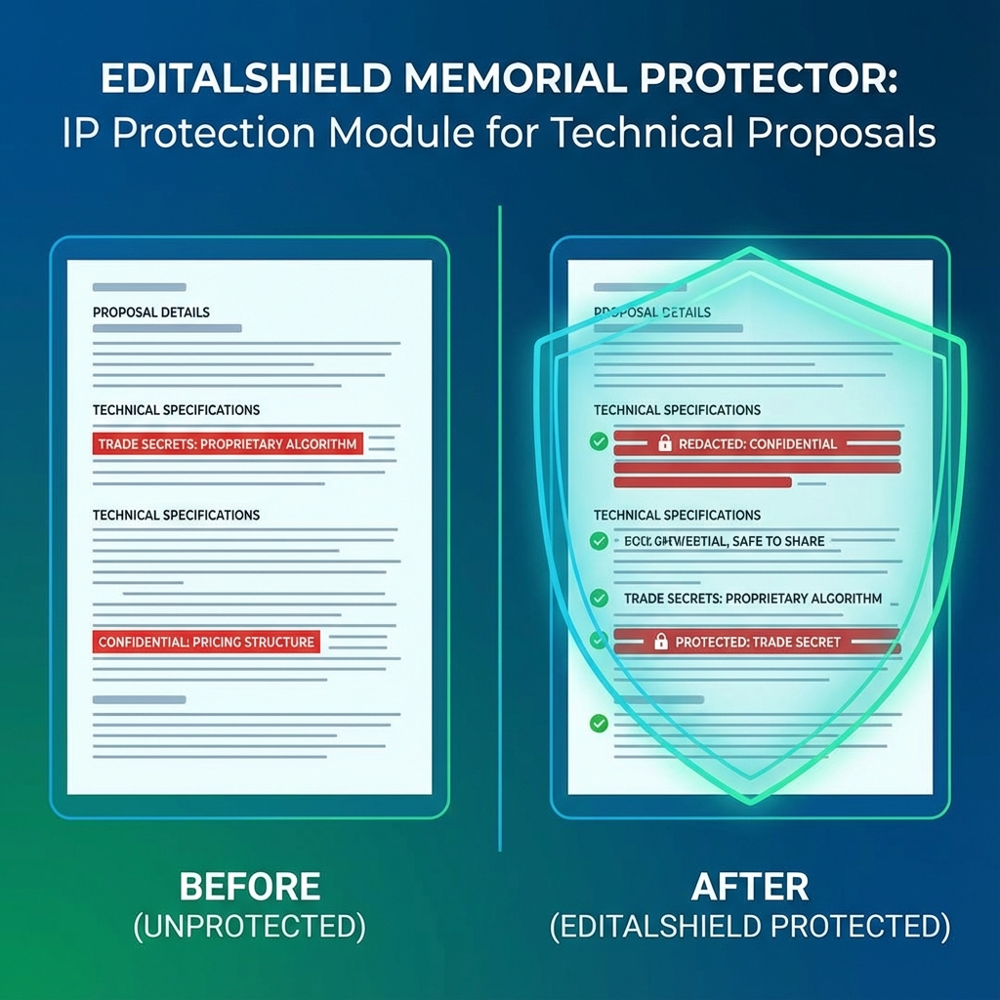

<p align="center">
  
</p>

<h1 align="center">EditalShield 🛡️</h1>

[](https://www.python.org/downloads/)
[](https://opensource.org/licenses/MIT)
[](https://github.com/psf/black)

**Framework open-source para análise e proteção de propriedade intelectual em submissões a editais de inovação brasileiros.**

---

## 🎯 Para Quem?

✅ **Founders & CEOs** → Proteção rápida sem custo  
✅ **Equipes jurídicas** → Due diligence automatizada  
✅ **Aceleradoras** → Validação de portfólio  
✅ **Consultores** → Ferramenta para seus clientes  
✅ **Pesquisadores** → Base para pesquisa acadêmica  

---

## 💡 O Problema

Startups enfrentam um dilema ao submeter projetos a editais (Centelha, PIPE, Finep, CNPq):

1. **Revelar detalhes técnicos** → Transmite inovação, mas expõe trade secrets
2. **Ser vago** → Protege PI, mas perde competitividade

**Resultado**: Exposição de propriedade intelectual + incerteza sobre custos + risco legal desprotegido.

---

## ✅ A Solução

EditalShield automatiza:

- 🛡️ **Proteção de PI** enquanto mantém clareza técnica
- 💰 **Negociação de contratos** com NDA parametrizado e teto transparente
- 📊 **Comparação de editais** com base em seu perfil
- ✅ **Validação completa** antes de submeter
- 🎯 **Planejamento de cenários** e contingências

---

## 🔄 Como Funciona



---

---

## 🏗️ Arquitetura



## 📦 Módulos

### 1️⃣ **Edital Selector**
Compara 20+ editais brasileiros automaticamente. Recomenda o melhor fit para seu projeto.

```bash
editalshield select --sector varejo --stage pre-seed --value-min 50000 --value-max 100000
```

### 2️⃣ **Gap Analyzer**
Identifica o que falta para você ser elegível. Plano de ação com prazos.

```bash
editalshield analyze-gaps --project config.json --edital centelha_ba_2025
```

### 3️⃣ **NDA Generator**
Cria contrato defensivo mas justo. Detecta se termos são abusivos.

```bash
editalshield generate-nda --project "Seu Projeto" --founders "Nome1,Nome2" --success-fee 20 --teto 12000
```

### 4️⃣ **Memorial Protector** ⭐
Protege trade secrets automaticamente usando NLP + padrões.



```bash
editalshield protect-memorial --input memorial.md --sensitivity high --output memorial_safe.md
```

### 5️⃣ **Cost Calculator**
Calcula com precisão o que você vai pagar. Simula 4 cenários.

```bash
editalshield calculate-fee --valor-aprovado 86000 --success-fee 20 --teto 12000 --parcelas 3
```

### 6️⃣ **Scenario Planner**
Prepara contingências. "O edital glosou? Aqui está o plano."

```bash
editalshield plan-scenarios --edital centelha_ba_2025 --valor-aprovado 86000
```

---

## ⚡ Instalação

### Opção 1: Via pip (quando publicado)
```bash
pip install editalshield
```

### Opção 2: Desenvolvimento local
```bash
# Clone o repositório
git clone https://github.com/symbeon/editalshield.git
cd editalshield

# Crie ambiente virtual
python -m venv venv
source venv/bin/activate  # No Windows: venv\Scripts\activate

# Instale dependências
pip install -r requirements.txt

# Instale em modo desenvolvimento
pip install -e .
```

---

## 🚀 Uso Rápido

### Exemplo 1: Encontrar melhor edital
```python
from editalshield import EditalSelector

selector = EditalSelector()
ranking = selector.rank({
    "setor": "varejo",
    "estagio": "pre-seed",
    "valor_minimo": 50000,
    "valor_maximo": 200000,
    "tempo_disponivel_meses": 6
})

print(f"Melhor edital: {ranking[0].edital_nome}")
print(f"Fit Score: {ranking[0].fit_score}/100")
```

### Exemplo 2: Proteger memorial técnico
```python
from editalshield import MemorialProtector

protector = MemorialProtector(sensitivity="high")
result = protector.analyze("memorial.md")

print(f"Risk Score: {result.risk_score}/100")
print(f"Trade secrets expostos: {result.summary.critical}")
```

---

## 🧮 Fundamentação Científica

O EditalShield se diferencia por utilizar modelos matemáticos avançados para garantir precisão e segurança:

- **Entropia de Shannon**: Para medir densidade de informação e risco de PI.
- **TF-IDF + Cosseno**: Para matching semântico de editais.
- **Redes Bayesianas**: Para cálculo probabilístico de risco.
- **Lei de Metcalfe**: Fundamentando o crescimento exponencial do valor da rede.

👉 **[Leia o Modelo Matemático Completo](MATHEMATICAL_MODEL.md)**

---

## 📊 Impacto Comprovado

Validação com caso real (startup varejo tech + Centelha BA):

| Métrica | Antes | Depois | Melhoria |
|---------|-------|--------|----------|
| **Score de Risco de PI** | 45/100 | 8/100 | ↓ 82% |
| **Trade secrets expostos** | 7 | 0 | ↓ 100% |
| **Clareza técnica** | 7.2/10 | 8.5/10 | ↑ 18% |
| **Economia em honorários** | — | R$ 12k (teto) | 💰 R$ 5.2k economizados |

---

## 📚 Documentação

- **[Arquitetura](docs/architecture.md)** - Visão geral dos 6 módulos
- **[API Reference](docs/api_reference.md)** - Documentação técnica completa
- **[Whitepaper Técnico](docs/whitepaper_tecnico.pdf)** - Metodologia e validação
- **[Whitepaper Executivo](docs/whitepaper_executivo.pdf)** - Visão de negócio
- **[Notebooks](notebooks/)** - Tutoriais interativos

---

## 🤝 Contribuindo

Contribuições são bem-vindas! Veja [CONTRIBUTING.md](CONTRIBUTING.md) para diretrizes.

### Desenvolvimento

```bash
# Instale dependências de desenvolvimento
pip install -r requirements.txt

# Execute testes
pytest tests/ --cov

# Formate código
black src/ tests/ cli/

# Verifique tipos
mypy src/
```

---

## 🔐 Segurança & Privacidade

- ✅ **Open-source** (MIT License) — você controla o código
- ✅ **Nenhum dado deixa seu computador** — roda localmente
- ✅ **Nenhum account necessário** — CLI puro
- ✅ **Dados genéricos** — não treina com seu projeto específico

---

## 📈 Roadmap

- ✅ **v0.1** (Dezembro 2025): 6 módulos implementados + docs
- 🔄 **v0.2** (Janeiro 2026): ML para classificação automática de sensibilidade
- 🔄 **v0.3** (Fevereiro 2026): Expansão para editais internacionais (NSF, Horizon Europe)
- 🔄 **v0.4** (Março 2026): Monitoramento pós-aprovação

---

## 📄 Licença

Este projeto está licenciado sob a [MIT License](LICENSE).

---

## 📞 Suporte & Comunidade

- **Issues**: [GitHub Issues](https://github.com/symbeon/editalshield/issues)
- **Discussões**: [GitHub Discussions](https://github.com/symbeon/editalshield/discussions)
- **Email**: contato@symbeon.lab

---

## 📝 Citação

Se você usar EditalShield em pesquisa, cite como:

```bibtex
@software{oliveira2025editalshield,
  title={EditalShield: Framework Sistemático para Proteção de PI em Editais},
  author={Oliveira, João M.},
  year={2025},
  url={https://github.com/symbeon/editalshield}
}
```

---

## 🌟 Agradecimentos

EditalShield foi desenvolvido para democratizar o acesso a ferramentas de due diligence jurídica e técnica no ecossistema de inovação brasileiro.

**Open-source. Para o ecossistema de inovação brasileiro.**

---

**EditalShield**: Proteja sua inovação. Maximize sua aprovação. Minimize seus custos.
